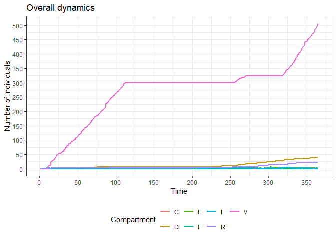

A stochastic meta-population model of Ebola virus disease transmission
================
Thibaut Jombart

## Required libraries

Run this code if you need to install the libraries used in this script.
You normally need to do this only once:

``` r
if (!require(tidyverse)) install.packages("tidyverse")
#> Loading required package: tidyverse
#> ── Attaching core tidyverse packages ──────────────────────── tidyverse 2.0.0 ──
#> ✔ dplyr     1.1.4     ✔ readr     2.1.5
#> ✔ forcats   1.0.1     ✔ stringr   1.6.0
#> ✔ ggplot2   4.0.1     ✔ tibble    3.3.0
#> ✔ lubridate 1.9.4     ✔ tidyr     1.3.1
#> ✔ purrr     1.2.0     
#> ── Conflicts ────────────────────────────────────────── tidyverse_conflicts() ──
#> ✖ dplyr::filter() masks stats::filter()
#> ✖ dplyr::lag()    masks stats::lag()
#> ℹ Use the conflicted package (<http://conflicted.r-lib.org/>) to force all conflicts to become errors
if (!require(rio)) install.packages("rio")
#> Loading required package: rio
if (!require(here)) install.packages("here")
#> Loading required package: here
#> here() starts at C:/dev/geomatys/ebola_model_odin
if (!require(dde)) install.packages("dde")
#> Loading required package: dde
if (!require(odin)) install.packages("odin")
#> Loading required package: odin
```

We load required libraries:

``` r
library(tidyverse)
library(rio)
library(here)
library(odin)
```

## Loading and compiling the odin script

The model is implemented in the *odin* script *ebola.R*:

``` r
path_model <- here::here("odin", "ebola.R")
model_generator <- odin::odin(path_model)
#> Loading required namespace: pkgbuild
#> Generating model in c
#> ℹ Re-compiling ebolae1b5f94f (debug build)
#> ── R CMD INSTALL ───────────────────────────────────────────────────────────────
#>   ─  installing *source* package 'ebolae1b5f94f' ...
#>      ** this is package 'ebolae1b5f94f' version '0.0.1'
#>    ** using staged installation
#>      ** libs
#>      using C compiler: 'gcc.exe (GCC) 14.2.0'
#>      gcc  -I"C:/PROGRA~1/R/R-45~1.2/include" -DNDEBUG     -I"C:/rtools45/x86_64-w64-mingw32.static.posix/include"      -O2 -Wall -std=gnu2x -gdwarf-2 -mfpmath=sse -msse2 -mstackrealign   -UNDEBUG -Wall -pedantic -g -O0 -c odin.c -o odin.o
#>      gcc  -I"C:/PROGRA~1/R/R-45~1.2/include" -DNDEBUG     -I"C:/rtools45/x86_64-w64-mingw32.static.posix/include"      -O2 -Wall -std=gnu2x -gdwarf-2 -mfpmath=sse -msse2 -mstackrealign   -UNDEBUG -Wall -pedantic -g -O0 -c registration.c -o registration.o
#>      gcc -shared -static-libgcc -o ebolae1b5f94f.dll tmp.def odin.o registration.o -LC:/rtools45/x86_64-w64-mingw32.static.posix/lib/x64 -LC:/rtools45/x86_64-w64-mingw32.static.posix/lib -LC:/PROGRA~1/R/R-45~1.2/bin/x64 -lR
#>      installing to C:/Users/thiba/AppData/Local/Temp/Rtmp4EaZqN/devtools_install_53843213655/00LOCK-file53842ee56fa/00new/ebolae1b5f94f/libs/x64
#>   ─  DONE (ebolae1b5f94f)
#> 
#> ℹ Loading ebolae1b5f94f
class(model_generator)
#> [1] "odin_generator"
model_generator
#> <odin_model> object generator
#>   Public:
#>     initialize: function (..., user = list(...), use_dde = FALSE, unused_user_action = NULL) 
#>     ir: function () 
#>     set_user: function (..., user = list(...), unused_user_action = NULL) 
#>     initial: function (step) 
#>     rhs: function (step, y) 
#>     update: function (step, y) 
#>     contents: function () 
#>     transform_variables: function (y) 
#>     engine: function () 
#>     run: function (step, y = NULL, ..., use_names = TRUE) 
#>   Private:
#>     ptr: NULL
#>     use_dde: NULL
#>     odin: NULL
#>     variable_order: NULL
#>     output_order: NULL
#>     n_out: NULL
#>     ynames: NULL
#>     interpolate_t: NULL
#>     cfuns: list
#>     dll: ebolae1b5f94f
#>     user: alert_efficacy alert_release alert_threshold alpha area  ...
#>     registration: function () 
#>     set_initial: function (step, y, use_dde) 
#>     update_metadata: function () 
#>   Parent env: <environment: namespace:ebolae1b5f94f>
#>   Locked objects: TRUE
#>   Locked class: FALSE
#>   Portable: TRUE
```

The object `model_generator` can be used to create new instance of the
model using the `$new()` operator. But first, we need to read in inputs
for the model.

## Data inputs

We read inputs including populations locations and sizes:

``` r
file_patches <- here::here("data", "patches_857.csv")
patches <- rio::import(file_patches) %>% 
  tibble() %>% 
  mutate(
    mean_intros = eta * pop_size * 365, # mean introductions per year
    weight_intros = mean_intros / sum(mean_intros)
  ) 
dim(patches)
#> [1] 857   9
head(patches)
#> # A tibble: 6 × 9
#>      V1     x     y     eta pop_size area_sqkm cell.id mean_intros weight_intros
#>   <int> <dbl> <dbl>   <dbl>    <int>     <dbl>   <int>       <dbl>         <dbl>
#> 1     1  19.1 -4.02 3.02e-9     1114      21.3  1.85e7    0.00123      0.000696 
#> 2     2  19.2 -4.02 2.69e-9     3357      21.3  1.85e7    0.00330      0.00187  
#> 3     3  19.2 -4.02 1.77e-9     2070      21.3  1.85e7    0.00134      0.000757 
#> 4     4  19.2 -4.02 1.89e-9      155      21.3  1.85e7    0.000107     0.0000607
#> 5     5  19.3 -4.02 3.01e-9     2911      21.3  1.85e7    0.00320      0.00181  
#> 6     6  19.3 -4.02 3.02e-9      859      21.3  1.85e7    0.000945     0.000536
```

We read in the connectivity matrix between the 857 populations

``` r
file_delta <- here::here("data", "delta_857.rds")
delta <- rio::import(file_delta)
#> Warning: Missing `trust` will be set to FALSE by default for RDS in 2.0.0.
dim(delta)
#> [1] 857 857
delta[1:4, 1:4]
#>            18459819  18459820   18459821   18459822
#> 18459819 0.82760654 0.0000000 0.02430165 0.00000000
#> 18459820 0.04603330 0.6844091 0.04603330 0.02430165
#> 18459821 0.02430165 0.0000000 0.69371632 0.04603330
#> 18459822 0.00000000 0.0000000 0.04603330 0.73289993
```

## Random distributions

Probability distributions are used for some of the inputs of the model,
in line with estimates reported in the literature.

``` r

# Inverse of the incubation time, average 9.4 days - West Africa 2014
r_alpha <- function(n) {
  mean_incub <- rlnorm(n, meanlog = log(9.4), sdlog = 0.05)
  1 / mean_incub
}
  
# inverse of the duration of illness
# this one is a bit more complex, as we have distinct mean durations
# for fatal cases and survivors, so it is a mix based on the CFR (assumed 2/3 
# by default)
# Time to recovery 16.4 ± 6.5 West Africa 2014
# Time to death 7.5 ± 6.8 West Africa 2014
r_gamma <- function(n, cfr = 2/3) {
  weighted_mean <- ((1 - cfr) * 16.4) + (cfr * 7.5)
  mean_illness <- rlnorm(n, meanlog = log(weighted_mean), sdlog = 0.1)
  1 / mean_illness
}

# beta - rate of infection; for this one, we first get values of R0, and then use the conversion: R0 = beta / gamma (Keeling & Rohani 2008 p.42), so beta = R0 * gamma
#
# We make a distribution compatible with most recent outbreaks
r_beta <- function(gamma) {
  n <- length(gamma)
  R0 <- rlnorm(n, meanlog = log(1.5), sdlog = 0.1)
  R0 * gamma
}

## coefficients for the betas of I, C, F
w_beta_ICF <- c(0.8, 0.0025, 1.3)
```

## Creating an instance of the model

Here we create a new model instance using `model_generator$new()`, using
the population structure we have just loaded.

``` r

J <- nrow(patches) # number of patches

## draw initial introductions
ini_I <- rmultinom(
  n = 1,
  size = 1, # specify the number of initial introductions here
  prob = patches$weight_intros
  ) %>% 
  as.integer()

## draw random parameters
set.seed(123)
alpha <- r_alpha(1)
gamma <- r_gamma(1)
beta <- r_beta(gamma)
beta_I <- beta * w_beta_ICF[1]
beta_C <- beta * w_beta_ICF[2]
beta_F <- beta * w_beta_ICF[3]

## eta must be a matrix time x patches; it is here constant over time, so we just repeat the first row, 365 times, which will be the duration of the simulation
eta_mat <- matrix(patches$eta, byrow = TRUE, nrow = 365, ncol = J)
dim(eta_mat)
#> [1] 365 857

model <- model_generator$new(
  n_patches = J,
  ini_S = as.integer(patches$pop_size),
  ini_E = rep(0L, J),
  ini_I = ini_I,
  ini_V = rep(0L, J),
  ini_F = rep(0L, J),
  ini_D = rep(0L, J),
  ini_C = rep(0L, J),
  ini_R = rep(0L, J),
  area = rep(1L, J), # no scaling of betas by area
  eta = eta_mat,
  delta = delta,
  alpha = alpha,
  gamma = gamma, 
  beta_I = beta_I, 
  beta_C = beta_C, 
  beta_F = beta_F, 
  tau = 1/2, # burial after 2 days
  pi = 1/10, # 1/10 survivors become convalescent
  rho = 1/90, # convalescent take 90 days to clear infection fully
  cfr = 2/3, 
  p_sdb = 0.3, # 30% safe and dignified burials in normal times
  p_sdb_alert = 0.5, # 50% safe and dignified burials in alert
  alert_threshold = c(0.1, 0.1),  # alert triggers when average 0.1 imported cases
  alert_release = 21, # alert stops after 3 weeks of inactivity
  alert_efficacy = 0.2, # 20% transmission reduction in alert
  vacc_coverage_alert = 0, # no vaccination during alerts
  p_sdb_response = 0.95, # 95% safe and dignified burials in response
  response_threshold = c(3, 1), # response triggers at 3 cases, stops when there are no cases
  response_release = 42, # response stops after 6 weeks of inactivity
  response_efficacy = 0.5, # 50% transmission reduction in response
  vacc_coverage_response = 0.2/365, # vaccination ~ 20% of the pop in a year in response
  vacc_efficacy = 0.95
  
)
```

## Running the model

Here we illustrate a single model run for 365 days (one run takes about
10-20s on a standard desktop).

``` r
set.seed(123)
system.time(res <- model$run(1:365))
#>    user  system elapsed 
#>   15.25    0.19   16.95
class(res)
#> [1] "matrix" "array"
dim(res)
#> [1]  365 7714
res[1:6, 1:10]
#>      step S[1] S[2] S[3] S[4] S[5] S[6] S[7] S[8] S[9]
#> [1,]    1 1114 3357 2070  155 2911  859  110  524  885
#> [2,]    2 1114 3357 2070  155 2911  859  110  524  885
#> [3,]    3 1114 3357 2070  155 2911  859  110  524  885
#> [4,]    4 1114 3357 2070  155 2911  859  110  524  885
#> [5,]    5 1114 3357 2070  155 2911  859  110  524  885
#> [6,]    6 1114 3357 2070  155 2911  859  110  524  885
colnames(res) %>% tail()
#> [1] "interv[852]" "interv[853]" "interv[854]" "interv[855]" "interv[856]"
#> [6] "interv[857]"
```

The result has one row per time step, indicated as the first column.
Other columns indicate the state of each compartment (first letter) in
each patch (indicated) within square brackets. The last columns indicate
the state of the patches, either ‘naive’ (value: 1), ‘alert’ (value: 2),
or ‘response’ (value: 3).

## Visualising results

### Time series

Here we first sum compartments across all patches, and visualize the
results as a time series:

``` r
comps <- c("V", "E", "I", "F", "D", "C", "R")
res_smry <- list()
for(e in comps) {
  to_keep <- grep(sprintf("^[%s]", e), colnames(res))
  res_smry[[e]] <- rowSums(res[, to_keep])
}
res_smry <- cbind(time = 1:365, data.frame(res_smry))
head(res_smry)
#>   time V E I F D C R
#> 1    1 0 0 1 0 0 0 0
#> 2    2 0 0 1 0 0 0 0
#> 3    3 0 0 1 0 0 0 0
#> 4    4 0 0 1 0 0 0 0
#> 5    5 0 0 1 0 0 0 0
#> 6    6 0 1 1 0 0 0 0

res_smry %>%
  pivot_longer(-1, names_to = "Compartment", values_to = "n") %>% 
  ggplot(aes(x = time, y = n, color = Compartment)) + 
  geom_line(size = 1) + 
  theme_bw() +
  labs(
    x = "Time",
    y = "Number of individuals", 
    title = "Overall dynamics"
    ) + 
  scale_x_continuous(n.breaks = 10) + 
  scale_y_continuous(n.breaks = 10) +
  theme(legend.position = "bottom")
#> Warning: Using `size` aesthetic for lines was deprecated in ggplot2 3.4.0.
#> ℹ Please use `linewidth` instead.
#> This warning is displayed once every 8 hours.
#> Call `lifecycle::last_lifecycle_warnings()` to see where this warning was
#> generated.
```



### Mapping total cases

Here we first isolate all compartments corresponding to infections, and
calculate total cases for every patch at the end of the simulation. Then
we map the results:

``` r
to_keep <- c(grep("^[EIDFRC]", colnames(res)))
temp <- res[res[, "step"] == 365, to_keep, drop = TRUE]
patch_id <- as.integer(gsub("[^[:digit:]]", "", names(temp)))
total_cases <- tapply(temp, patch_id, sum)

df <- cbind(patches, total_cases)

ggplot(df, aes(x = x, y = y)) + 
  geom_tile(aes(fill = total_cases)) + 
  scale_fill_viridis_c(
    option = "magma", 
    na.value = "transparent", 
    n.breaks = 7) + 
  labs(x = "Longitude", 
       y = "Latitude", 
       fill = "Total cases") + 
  scale_x_continuous(n.breaks = 10) + 
  scale_y_continuous(n.breaks = 10) + 
  theme(legend.position = "bottom")
```


